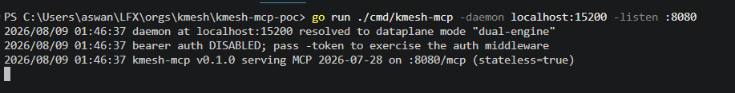
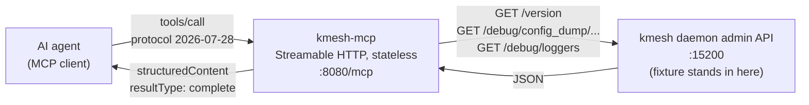
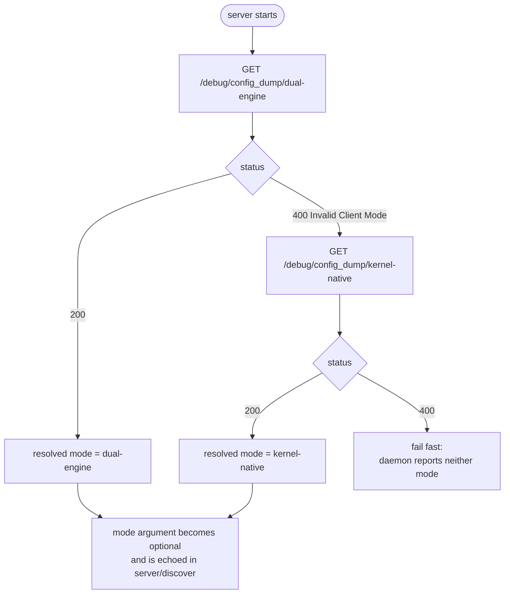
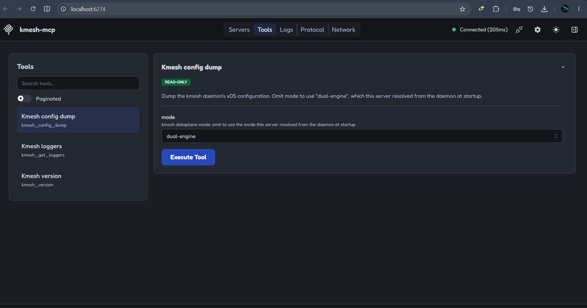
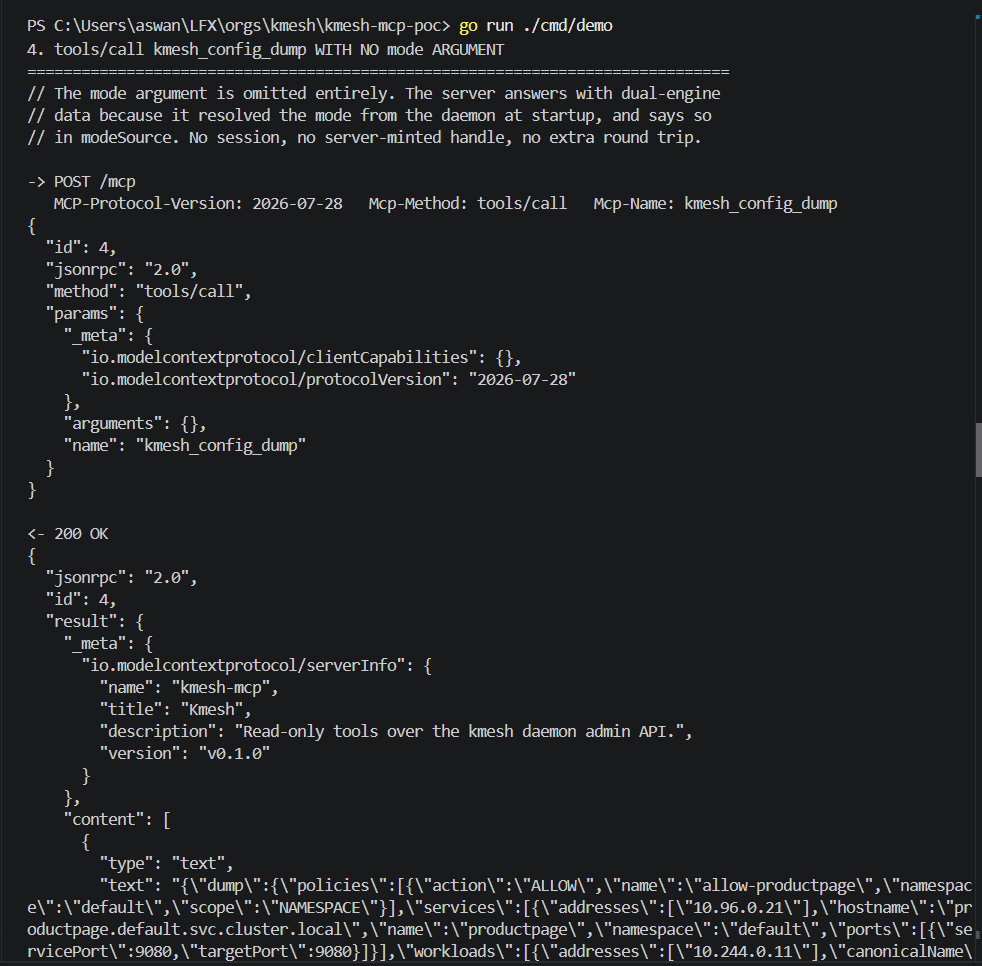
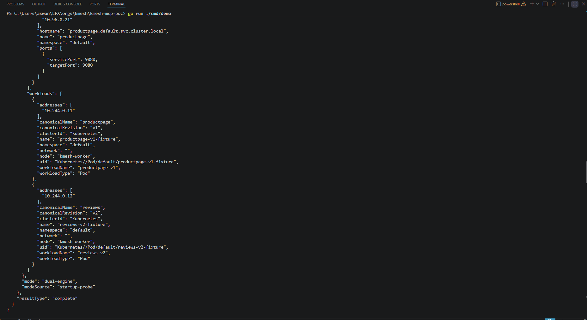
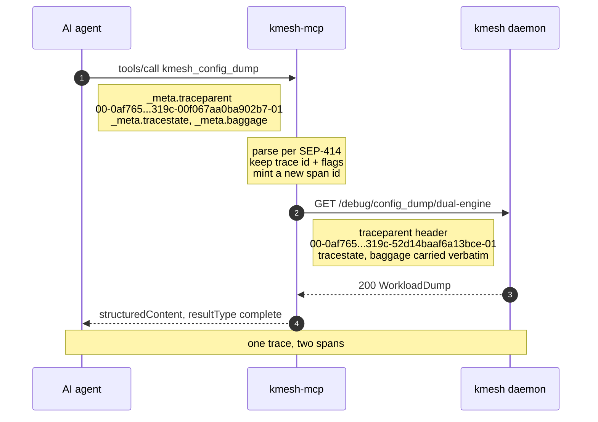
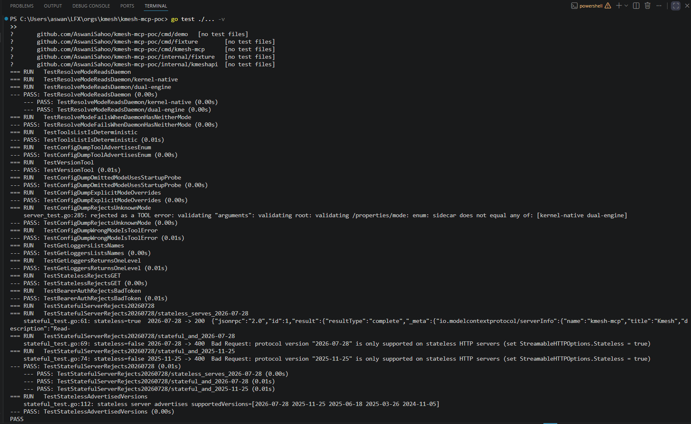

# kmesh-mcp-poc

[](https://github.com/AswaniSahoo/kmesh-mcp-poc/actions/workflows/ci.yml)
[](go.mod)
[](https://modelcontextprotocol.io/specification/2026-07-28)
[](LICENSE)

A working MCP server for [kmesh](https://github.com/kmesh-net/kmesh), built against MCP
protocol revision **2026-07-28**, that runs with **no Kubernetes cluster, no eBPF datapath
and no root**.

It exists to answer four questions in code rather than in prose.

| # | Question | Answer |
|---|---|---|
| 1 | Does an MCP server for kmesh work under 2026-07-28, where the `initialize` handshake and `Mcp-Session-Id` are gone? | Yes, with one struct field set |
| 2 | Without a protocol session, can `mode` stay optional on a config-dump tool? | Yes, and the mechanism is already in kmesh's own source |
| 3 | Can an agent's OpenTelemetry trace context survive the hop from MCP into the mesh's HTTP surface? | Yes, same trace, fresh span |
| 4 | How much of this is demonstrable without a cluster? | More than expected, well short of everything |

This is a proof of concept in a personal repository, not a proposed change to kmesh.
The honest boundary is [What this does not cover](#what-this-does-not-cover), and it is
longer than everything above it.

## Contents

- [Run it](#run-it)
- [How it fits together](#how-it-fits-together)
- [The three tools](#the-three-tools)
- [The mode question, answered from kmesh's source](#the-mode-question-answered-from-kmeshs-source)
- [Trace context, where this stops being a generic MCP server](#trace-context-where-this-stops-being-a-generic-mcp-server)
- [Three things that only showed up by running it](#three-things-that-only-showed-up-by-running-it)
- [Schema validation is real, not documentation](#schema-validation-is-real-not-documentation)
- [Statelessness is one struct field](#statelessness-is-one-struct-field)
- [Go version](#go-version)
- [Tests](#tests)
- [What this does not cover](#what-this-does-not-cover)

---

## Run it

Needs Go 1.25.0 or later, and nothing else.

```bash
git clone https://github.com/AswaniSahoo/kmesh-mcp-poc
cd kmesh-mcp-poc
go run ./cmd/demo
```

That starts a fixture kmesh daemon, resolves the dataplane mode from it, serves MCP in
front of it, and prints every JSON-RPC exchange. One process, no cluster, no root, no ports
to free. The full transcript is committed at [docs/demo-output.txt](docs/demo-output.txt).

```bash
go test ./...         # the test suite
go vet ./...

# two-terminal mode, for pointing a real MCP client at it
go run ./cmd/fixture
go run ./cmd/kmesh-mcp -daemon localhost:15200 -listen :8080
```

The server probes the daemon once on startup and reports what it found:



A [Makefile](Makefile) wraps these as `make run` / `make test` / `make check` / `make serve`.
The `go` commands are the verified path. `make` was not available on the machine this was
built on, so the Makefile itself is untested.

---

## How it fits together

Three processes in the two-terminal setup, or all three in one when you run `cmd/demo`.



The startup probe is what makes `mode` optional. kmesh answers `400 Invalid Client Mode` on
the config-dump route for the mode it is **not** running in, so exactly one route answers
`200` and the daemon effectively reports its own mode.



---

## The three tools

Three tools, chosen so each exercises a different input shape rather than three variations
of the same one.

| Tool | Input shape | kmesh route |
|---|---|---|
| `kmesh_version` | no arguments | `GET /version` |
| `kmesh_config_dump` | optional enum, server-resolved default | `GET /debug/config_dump/{kernel-native,dual-engine}` |
| `kmesh_get_loggers` | optional string that changes the response shape | `GET /debug/loggers[?name=]` |

Route names, response shapes and error behaviour were read from `kmesh-net/kmesh` at commit
`c88ef300`, `pkg/status/status_server.go`. The listen address `:15200` is kmesh's own
`adminAddr` (`status_server.go:48`), not an invented port.

Here are the three tools as an MCP client sees them: deterministic order, each marked
read-only, and `mode` rendered as a picker rather than a free-text box because the enum
reaches the client in the tool's input schema.



> **One honest note about that screenshot.** MCP Inspector v2.1.0 connects using the legacy
> `initialize` handshake, and this server accepts it and negotiates down to `2025-06-18`,
> which is the backward compatibility the SDK documents. So the picture shows the tools
> working, not the 2026-07-28 path. That path is exercised by `cmd/demo` and the tests.

---

## The mode question, answered from kmesh's source

An open question in [kmesh-net/kmesh#1800](https://github.com/kmesh-net/kmesh/issues/1800):
should the server detect the dataplane mode once at startup and drop `mode` from the tool
inputs entirely?

Under 2026-07-28 this looks harder than it is, because the revision removed sessions:
*"servers that need cross-call state use explicit, server-minted handles passed as ordinary
tool arguments"* (SEP-2567).

But the mode is not cross-call state. It is a fact about the daemon, and kmesh already
publishes it. Both config-dump handlers gate on whether the matching xDS controller exists,
and answer **HTTP 400** when it does not:

```go
func (s *Server) checkAdsMode(w http.ResponseWriter) bool {
	client := s.xdsClient
	if client == nil || client.AdsController == nil {
		w.WriteHeader(http.StatusBadRequest)
		fmt.Fprint(w, invalidModeErrMessage)   // "\tInvalid Client Mode\n"
		return false
	}
	return true
}
```
<sub>kmesh <code>pkg/status/status_server.go:131-149</code></sub>

So exactly one of the two routes answers 200 on a healthy daemon. One probe at startup
reads the mode off the daemon itself. That is not a cached session; it is the server
knowing a fact about what it is connected to.

The result: `mode` stays **optional**. Omit it and the server uses what it resolved; pass it
and the argument wins. Here is that call with no arguments at all:

```jsonc
-> POST /mcp
   MCP-Protocol-Version: 2026-07-28   Mcp-Method: tools/call   Mcp-Name: kmesh_config_dump
{
  "id": 4,
  "jsonrpc": "2.0",
  "method": "tools/call",
  "params": {
    "_meta": {
      "io.modelcontextprotocol/clientCapabilities": {},
      "io.modelcontextprotocol/protocolVersion": "2026-07-28"
    },
    "arguments": {},
    "name": "kmesh_config_dump"
  }
}

<- 200 OK
{
  "jsonrpc": "2.0",
  "id": 4,
  "result": {
    "structuredContent": {
      "mode": "dual-engine",
      "modeSource": "startup-probe",
      "dump": { "workloads": [ ... ], "services": [ ... ], "policies": [ ... ] }
    },
    "resultType": "complete"
  }
}
```

The same exchange as it actually runs. The request carries `"arguments": {}` and nothing
else:



and the response ends on the mode the server resolved for itself:



`modeSource` is reported so a caller can tell whether it got the mode it asked for or the
one the server resolved for it. Full untruncated response:
[docs/demo-output.txt](docs/demo-output.txt).

The resolved mode is also discoverable *before* any tool call, in the mandatory
`server/discover` response:

```json
"instructions": "Read-only access to a kmesh daemon at 127.0.0.1:60925. The daemon reported dataplane mode \"dual-engine\" at startup; kmesh_config_dump uses that mode when its mode argument is omitted."
```

---

## Trace context, where this stops being a generic MCP server

The 2026-07-28 revision reserves `traceparent`, `tracestate` and `baggage` in `_meta` for
OpenTelemetry trace context (SEP-414, Final), as an **explicit exception to the
`io.modelcontextprotocol/` prefix rule**. The same revision deprecates MCP Logging and
points implementations at OpenTelemetry instead (SEP-2577).

For most servers that is a footnote. For a service mesh it is the point. kmesh exists to
make service-to-service calls observable. If an agent calls `kmesh_config_dump`, the
agent's view of that call and the mesh's view of the same call should be **one trace, not
two**. That only happens if the trace context survives the hop out of MCP and into the
daemon's own HTTP surface.



The trace id is preserved and the span id is replaced, so the daemon call is a *child* of
the tool call rather than a duplicate of it. `tracestate` and `baggage` pass through
untouched, since their contents are vendor-defined.

Observed end to end, printed by `cmd/demo`:

```text
in  (MCP _meta)      traceparent: 00-0af7651916cd43dd8448eb211c80319c-00f067aa0ba902b7-01
out (daemon header)  traceparent: 00-0af7651916cd43dd8448eb211c80319c-52d14baaf6a13bce-01
out (daemon header)  tracestate:  kmesh=abc
out (daemon header)  baggage:     userId=42
```

Three behaviours worth stating, each with a test:

- A request with **no** `traceparent` produces **no** headers. This server does not invent
  trace context for clients that never asked for it.
- A **malformed** `traceparent` does not fail the tool call. W3C Trace Context says a
  receiver that cannot parse it should restart the trace rather than propagate something
  invalid, so the call succeeds and the daemon hop goes out untraced.
- Propagation is a property of the server, not of one handler. All three tools are covered.

The go-sdk ships no helper for these keys as of v1.7.0, so the parsing and propagation are
implemented in [internal/tracectx](internal/tracectx).

---

## Three things that only showed up by running it

None of these were obvious from the changelog, and each is a 400 until you fix it.

**1. The `MCP-Protocol-Version` HTTP header is not sufficient.** A request that sets only
the header is rejected:

```json
{"code": -32602, "message": "missing or invalid _meta field \"io.modelcontextprotocol/protocolVersion\""}
```

The version must be in `params._meta`. Then `clientCapabilities` is required there too.
With `initialize` gone there is no other moment at which a client could declare what it
supports, so it declares it on every request.

**2. `Mcp-Method` is enforced, with its own error code.** Omitting it fails before the body
is parsed:

```json
{"code": -32020, "message": "missing required Mcp-Method header"}
```

**3. Version negotiation is genuinely per-request.** A client declaring `2025-06-18` is
served at that revision by the same server, and the response comes back *without*
`resultType`, because that field belongs to 2026-07-28. An unsupported revision is rejected
with the supported set attached, so the client can retry immediately:

```text
<- 400 Bad Request
Bad Request: Unsupported protocol version (supported versions: 2026-07-28,2025-11-25,2025-06-18,2025-03-26,2024-11-05)
```

---

## Schema validation is real, not documentation

`kmesh_config_dump`'s `mode` property carries a hand-added `enum` on top of the inferred
schema. The handler never checks the value. An invalid mode is still rejected:

```text
"text": "validating \"arguments\": validating root: validating /properties/mode: enum: sidecar does not equal any of: [kernel-native dual-engine]"
"isError": true
```

It comes back as a **tool** error rather than a protocol error, which is the useful
behaviour: a model can read it and correct itself. Enforcement is
`github.com/google/jsonschema-go v0.4.3` via the SDK's SEP-2106 validation path. This was an
open question when the design was written; `TestConfigDumpRejectsUnknownMode` settles it.

---

## Statelessness is one struct field

```go
mcp.NewStreamableHTTPHandler(
	func(*http.Request) *mcp.Server { return srv },
	&mcp.StreamableHTTPOptions{Stateless: true},
)
```

This is not a preference. `TestStatefulServerRejects20260728` posts the same request to both
builds of the same server:

```text
stateless=true   2026-07-28 -> 200
stateless=false  2026-07-28 -> 400  protocol version "2026-07-28" is only supported on
                                    stateless HTTP servers (set StreamableHTTPOptions.Stateless = true)
```

So on Streamable HTTP the flag decides whether you serve the current revision at all. The
SDK's release notes say as much; the test is here because a claim like that is worth
pinning to something executable.

Its other observable cost, shown in the transcript: `GET /mcp` returns **405 Method Not
Allowed**, because a stateless server has no stream to open.

The SDK notes that the spec's stateless semantics are still settling. If they move,
reverting is a one-line change in [internal/mcpserver/http.go](internal/mcpserver/http.go)
and nowhere else in this repo.

---

## Go version

The SDK's `go.mod` declares `go 1.25.0`. kmesh declares `go 1.24.2` (`kmesh/go.mod`, commit
`c88ef300`). This module is standalone and declares `go 1.25.0`, so nothing here is blocked
by that.

It is not free, though. **Vendoring an MCP server built on this SDK into kmesh itself would
require kmesh to raise its own go directive from 1.24.2 to at least 1.25.0.** That is a
decision for the maintainers, not a detail to discover during implementation. Anyone
proposing this work inside `kmesh/mcp/` should raise it up front.

---

## Tests

```text
$ go test ./...
ok  	github.com/AswaniSahoo/kmesh-mcp-poc/internal/mcpserver	3.99s
ok  	github.com/AswaniSahoo/kmesh-mcp-poc/internal/tracectx	1.25s
```

```text
$ go test ./... -v
--- PASS: TestResolveModeReadsDaemon (0.01s)
--- PASS: TestResolveModeFailsWhenDaemonHasNeitherMode (0.00s)
--- PASS: TestToolsListIsDeterministic (0.02s)
--- PASS: TestConfigDumpToolAdvertisesEnum (0.01s)
--- PASS: TestVersionTool (0.01s)
--- PASS: TestConfigDumpOmittedModeUsesStartupProbe (0.00s)
--- PASS: TestConfigDumpExplicitModeOverrides (0.01s)
--- PASS: TestConfigDumpRejectsUnknownMode (0.00s)
--- PASS: TestConfigDumpWrongModeIsToolError (0.00s)
--- PASS: TestGetLoggersListsNames (0.00s)
--- PASS: TestGetLoggersReturnsOneLevel (0.00s)
--- PASS: TestStatelessRejectsGET (0.00s)
--- PASS: TestBearerAuthRejectsBadToken (0.00s)
--- PASS: TestStatefulServerRejects20260728 (0.01s)
--- PASS: TestStatelessAdvertisedVersions (0.00s)
--- PASS: TestTraceContextReachesTheDaemon (0.00s)
--- PASS: TestTraceContextOnEveryTool (0.01s)
--- PASS: TestUntracedRequestSendsNoHeader (0.00s)
--- PASS: TestMalformedTraceparentDoesNotFailTheCall (0.00s)
ok  	github.com/AswaniSahoo/kmesh-mcp-poc/internal/mcpserver
--- PASS: TestParseSpecExample (0.00s)
--- PASS: TestParseRejects (0.00s)
--- PASS: TestSampledBit (0.00s)
--- PASS: TestFromMeta (0.00s)
--- PASS: TestChildKeepsTraceDropsSpan (0.00s)
--- PASS: TestRandomSpanIDIsUsableAndDistinct (0.00s)
--- PASS: TestHeaders (0.00s)
ok  	github.com/AswaniSahoo/kmesh-mcp-poc/internal/tracectx
```



<sub>This screenshot predates the trace-context package, so it shows the earlier 15-test
run. The pasted output above is current.</sub>

**26 tests across two packages**, plus subtests. CI runs `gofmt`, `go vet`, `go build`,
`go test -race`, and the demo end to end on every push, so a README that stops being true
turns the badge red.

The coverage is of the MCP layer, the trace-context handling and the daemon client. It is
not coverage of kmesh.

---

## What this does not cover

The point of this section is that the list above is short and this one is not.

**The fixtures are authored, not captured.** Payloads in
[internal/fixture](internal/fixture) are checked field by field against the Go types the
daemon actually marshals (`pkg/status/api.go:32-91`), including json tags, which fields
carry `omitempty`, enum `String()` casing, and the sort applied before marshalling. Four
things that are easy to get wrong are deliberately right: a Service's addresses serialise
under `vips` rather than `addresses`; `workloadType` and `status` are upper case because
they are enum names; `protocol`, `serviceAccount` and `status` appear even when empty
because they carry no `omitempty`; and `locality` and `applicationTunnel` appear as objects
because `omitempty` does nothing on a struct.

So the **shape** is faithful down to key names. **The values are invented**, and nothing
here was recorded from a running daemon, so anything depending on real data (volumes,
timing, protojson quirks in the kernel-native dump, whether a real cluster ever produces
this exact combination of fields) is not demonstrated.

**Why not just import kmesh's own handlers instead of writing a fixture?** Because it does
not compile outside kmesh's build. `pkg/status` reaches `pkg/bpf`, which reaches the
bpf2go-generated packages, which `//go:embed` compiled eBPF object files. Those `.o` files
are build artifacts excluded by kmesh's `.gitignore`, so an external Go module importing
`kmesh.net/kmesh/pkg/status` fails with `pattern kmeshcgroupskb_bpfel.o: no matching files
found`, and `pkg/cache/v2/maps` is excluded by build constraints on top of that. Verified by
trying it. The consequence is worth stating plainly: **even the handlers that touch no eBPF
at all, such as `/version` and `/debug/loggers`, cannot be imported or exercised by anything
outside the kmesh build.** An MCP server living inside the kmesh tree inherits that build
and could call them directly; a separate module cannot. That is one concrete reason the
process-model question matters.

**No eBPF, and therefore no `get_bpf_maps`.** kmesh's `/debug/config_dump/bpf/*` routes read
live eBPF maps through `BackendLookupAll`, `EndpointLookupAll`, `FrontendLookupAll`,
`ServiceLookupAll`, `WorkloadPolicyLookupAll`, `ClusterLookupAll`, `ListenerLookupAll` and
`RouteConfigLookupAll`. No fixture substitutes for a loaded datapath, so those routes are
deliberately absent.

**No waypoint tools.** They need a live Kubernetes API with Gateway API CRDs installed.
`waypoint generate` is pure templating and would have been cheap, but it is excluded to keep
the boundary of this PoC unambiguous.

**Authentication is a seam, not an implementation.** The SDK's bearer middleware really is
in the request path and really does reject bad tokens, which
`TestBearerAuthRejectsBadToken` proves. The verifier behind it compares against a fixed
string. A real deployment replaces [internal/tokenauth](internal/tokenauth) with a
Kubernetes TokenReview call and changes nothing else. **mTLS is not addressed at all.**

**Trace context is propagated, not produced.** [internal/tracectx](internal/tracectx) parses
W3C trace context out of `_meta` and continues it as headers on the daemon call. It does
**not** emit OpenTelemetry spans, register a `TracerProvider`, or export anything to a
collector, and there is no OTel SDK dependency here at all. A real deployment would add one.
What is proven is that the context survives the hop, not that anything is recorded. The
kmesh side is unproven too: whether the daemon does anything useful with a `traceparent`
header today was not tested, because that needs a live daemon.

**Read-only.** No `log set`, no `authz enable/disable`, no monitoring toggles. Every tool is
a GET.

**Not built inside kmesh.** No `go build` or `go get` was run against the kmesh tree, so
whether this SDK coexists cleanly with kmesh's dependency graph (`cilium/ebpf`,
`envoyproxy/go-control-plane`) is **untested**. See [Go version](#go-version).

**Three tools, not ten.** #1800 lists ten core tools and five stretch tools. This covers
three, chosen for schema variety. Nothing here says the other seven are easy.

**No kmesh CI, no e2e, no container image, no `kmeshctl mcp serve`.**

---

## Licence

Apache-2.0. See [LICENSE](LICENSE).
